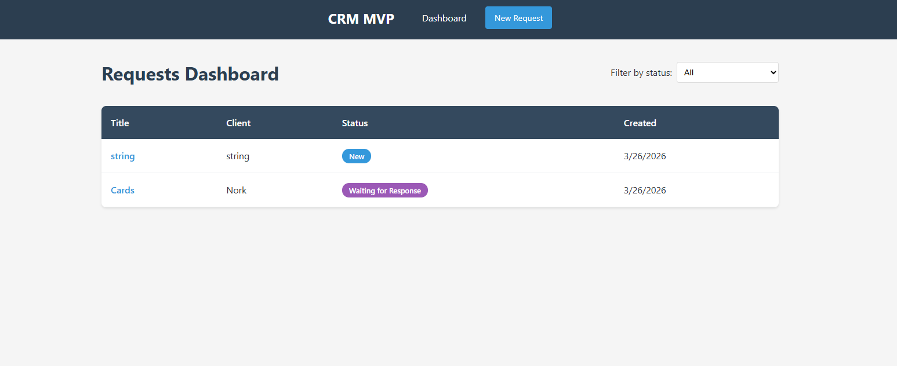
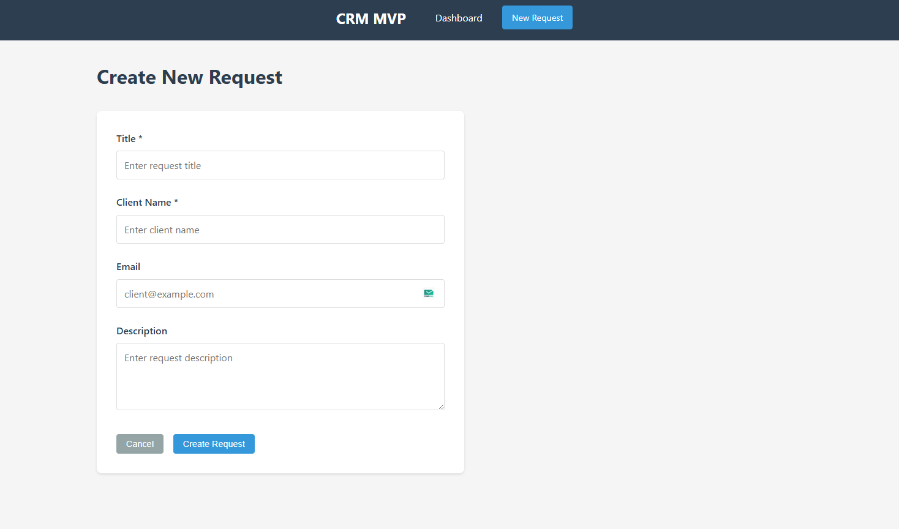
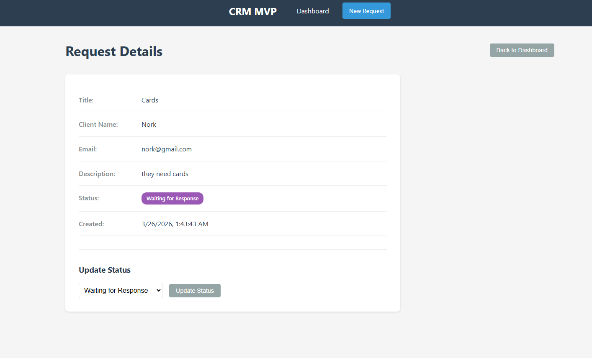

# CRM MVP - Request Management System

MVP веб-приложения для управления заявками (requests / leads / tickets).

## Что реализовано

- ✅ Создание заявки (title, clientName, email, description)
- ✅ Просмотр списка заявок в таблице с сортировкой по дате
- ✅ Фильтрация заявок по статусу
- ✅ Просмотр деталей заявки
- ✅ Изменение статуса заявки (dropdown + кнопка)
- ✅ Валидация данных на бэкенде и фронтенде
- ✅ Обработка ошибок с понятными сообщениями
- ✅ Loading states (спиннеры при загрузке)
- ✅ Empty states ("нет заявок")
- ✅ Responsive UI (адаптация под мобильные)
- ✅ Docker-контейнеризация всех сервисов

## Стек технологий

**Frontend:**
- React.js 18 — библиотека для UI
- React Router 6 — навигация
- Axios — HTTP клиент
- CSS — стилизация без фреймворков

**Backend:**
- Node.js 18 — runtime
- Express.js — веб-фреймворк
- PostgreSQL 15 — реляционная БД
- Prisma ORM — работа с БД, миграции

**DevOps:**
- Docker + Docker Compose — контейнеризация

## Как запустить

### Быстрый старт (Docker)

```bash
# 1. Скопировать .env файлы
cp server/.env.example server/.env
cp client/.env.example client/.env

# 2. Собрать и запустить
docker-compose up --build

# 3. Миграции БД (первый запуск)
docker-compose exec server npx prisma migrate dev --name init
```

**URL:**
- Frontend: http://localhost:3000
- API: http://localhost:5000

### Локально (для разработки)

```bash
# Установка
cd server && npm install
cd ../client && npm install

# БД (Docker)
docker-compose up -d postgres

# Миграции
cd server
npx prisma migrate dev --name init

# Запуск (в разных терминалах)
cd server && npm run dev
cd client && npm start
```

## Что не успел сделать

- 🔲 Тесты (unit, integration, e2e)
- 🔲 CI/CD pipeline (GitHub Actions/GitLab CI)
- 🔲 Пагинация списка заявок
- 🔲 Поиск по заявкам
- 🔲 Удаление заявок
- 🔲 Редактирование заявок (только статус)
- 🔲 Комментарии к заявкам
- 🔲 История изменений (audit log)
- 🔲 Email-уведомления
- 🔲 Swagger/OpenAPI документация
- 🔲 TypeScript (типизация)

## Что бы улучшил в production-версии

### Архитектура
- **Микросервисы**: разделить на API Gateway, Auth Service, Request Service
- **Event-driven**: Kafka/RabbitMQ для асинхронных операций (email, webhooks)
- **CQRS**: отдельные модели для чтения и записи

### Инфраструктура
- **Kubernetes**: оркестрация контейнеров
- **Monitoring**: Prometheus + Grafana для метрик
- **Logging**: ELK stack (Elasticsearch + Logstash + Kibana)
- **Tracing**: Jaeger/Zipkin для распределенной трассировки

### Безопасность
- **Auth**: JWT + refresh tokens, OAuth2 (Google/GitHub SSO)
- **RBAC**: роли (admin, manager, viewer)
- **Валидация**: Joi/Zod на всех уровнях
- **Security headers**: Helmet.js
- **Rate limiting**: Redis-based

### Оптимизации
- **Кэширование**: Redis для частых запросов
- **CDN**: статика на CloudFront/Cloudflare
- **DB**: индексы, read replicas, connection pooling (PgBouncer)

---

## Архитектурное описание

### Почему выбрал такой стек

**React + Express + PostgreSQL:**
- Проверенная комбинация для MVP — быстрая разработка
- React — декларативный UI, большое комьюнити
- Express — минималистичный, гибкий, не навязывает структуру
- PostgreSQL — надежная ACID БД, хорошая поддержка сложных запросов
- Prisma ORM — type-safe запросы, автоматические миграции, хороший DX
- Docker — единое окружение, easy onboarding для новых разработчиков

**Альтернативы, которые рассматривал:**
- Nest.js — слишком много boilerplate для MVP
- MongoDB — не нужна гибкость схемы, реляционная модель подходит лучше
- Next.js — нет необходимости в SSR для админ-панели

### Как устроены модули

```
server/
├── src/
│   ├── controllers/     # Обработка HTTP запросов
│   │   └── requests.js   # CRUD операции для заявок
│   ├── routes/        # Маршрутизация
│   │   └── requests.js   # /api/requests/*
│   └── app.js         # Точка входа, middleware

client/
├── src/
│   ├── pages/         # Страницы приложения
│   │   ├── Dashboard.js      # Список + фильтр
│   │   ├── CreateRequest.js  # Форма создания
│   │   └── RequestDetails.js # Детали + статус
│   ├── services/
│   │   └── api.js     # Axios instance, API calls
│   ├── App.js         # Router + Layout
│   └── App.css        # Все стили в одном файле
```

**Паттерны:**
- Controller pattern на бэкенде — разделение HTTP и бизнес-логики
- Page-based routing на фронтенде — каждая страница = компонент
- Service layer для API — централизованные HTTP запросы

### Как устроена БД

```sql
Table: requests
├── id (SERIAL PRIMARY KEY)
├── title (TEXT NOT NULL)        -- Название заявки
├── client_name (TEXT NOT NULL)  -- Имя клиента
├── email (TEXT)                 -- Email клиента
├── description (TEXT)             -- Описание
├── status (TEXT DEFAULT 'New')  -- Статус заявки
└── created_at (TIMESTAMP)       -- Дата создания
```

**Статусы:**
- `New` — новая заявка
- `In Progress` — взята в работу
- `Waiting for Response` — ожидает ответа клиента
- `Completed` — выполнена
- `Rejected` — отклонена

**Индексы:**
- По умолчанию: `id` (PK), `created_at` (сортировка)
- Для фильтрации по статусу добавлен индекс через Prisma

**Связи:**
- Пока нет внешних ключей — MVP не требует сложных связей
- В production: users table, comments table, history table

### Как обрабатываются ошибки

**Backend (Express):**

```javascript
async create(req, res) {
  try {
    // ... logic
  } catch (error) {
    // Prisma ошибки — проверка кода
    if (error.code === 'P2025') {
      return res.status(404).json({ message: 'Request not found' });
    }
    // Общие ошибки — 500
    res.status(500).json({ message: 'Failed to create request' });
  }
}
```

**Frontend (React):**

```javascript
const [error, setError] = useState(null);
{error && <div className="error-message">{error}</div>}
```

**Уровни обработки:**
1. **Валидация входных данных** — 400 Bad Request
2. **Not Found** — 404 (заявка не найдена)
3. **Database errors** — 500 с общим сообщением
4. **Network errors** — отображаются пользователю

## Screenshots

### Dashboard


### Create Request


### Request Detail
